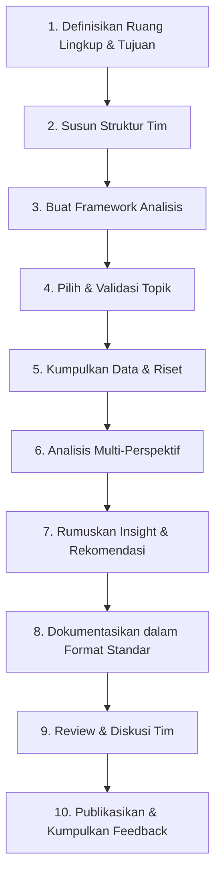

<div align="center">

# Retail Analytics Platform

**Platform analitik interaktif yang membantu pengguna memahami kinerja penjualan dan memperoleh prediksi revenue untuk mendukung pengambilan keputusan bisnis berbasis data.**


</div>

---

## Tentang Project Ini

Tim ini fokus membedah studi kasus bisnis dan produk dari sudut pandang **strategi, produk, operasional, dan pengguna**, dengan studi kasus utama saat ini: **Retail Analytics Platform**.

> **Tujuan utama:** membangun portofolio untuk meningkatkan peluang keterima kerja.
>
> **Tujuan web:** menyediakan platform analitik interaktif yang membantu pengguna memahami kinerja penjualan dan memperoleh prediksi revenue untuk mendukung pengambilan keputusan bisnis berbasis data.

Output akhir dari setiap case study idealnya bukan sekadar analisis akademis, tapi rekomendasi yang **actionable**:
*"Apa yang sebaiknya dilakukan tim produk berdasarkan temuan ini?"*

---

## Tujuan

| # | Tujuan |
|---|--------|
| 1 | Melatih kemampuan berpikir strategis lintas fungsi (bisnis, produk, data, UX) |
| 2 | Membangun repository studi kasus yang bisa jadi referensi tim internal |
| 3 | Menghasilkan rekomendasi konkret yang bisa diuji atau diterapkan |
| 4 | Mengasah kemampuan storytelling data dan presentasi insight ke stakeholder |

---

## Daftar Isi

- [Link Referensi](#link-referensi)
- [Setup Lokal](#setup-lokal)
- [Struktur Tim](#struktur-tim)
- [Status Tugas](#status-tugas)
- [Gambaran Website](#gambaran-website)
- [Business Problems & Goals](#business-problems--goals)
- [Framework Analisis](#framework-analisis)
- [Alur Kerja Case Study](#alur-kerja-case-study)
- [Struktur Folder](#struktur-folder)
- [Template Dokumentasi](#template-dokumentasi)

---

## Link Referensi

Link-link yang berguna selama pembuatan proyek:

| Referensi | Link |
|---|---|
| Dataset | [misata.studio/datasets/retail-star-schema](https://www.misata.studio/datasets/retail-star-schema) |
| GitHub Org | [Retail-Analytical-Platform](https://github.com/Retail-Analytical-Platform) |
| Gambaran web (inspirasi) | [goinsight.in/demo/retail](https://www.goinsight.in/demo/retail) |
| Referensi dashboard forecasting | [walmart-sales-forecasting-dashboard](https://github.com/acaca675/walmart-sales-forecasting-dashboard) |
| Referensi lain | [biziinsights.com](https://www.biziinsights.com/) |

---

## Setup Lokal

Repo ini menyediakan **dataset retail star-schema** (`data/`) untuk latihan query dan analisis data — satu fact table + empat dimension table, lengkap dengan jawaban yang sudah diverifikasi (lihat [`data/README.md`](data/README.md)).

Untuk load dataset ini ke database dan latihan query beneran, jalankan PostgreSQL lokal lewat Docker:

| Panduan | Deskripsi |
|---|---|
| [`Docker.md`](blob/main/Docker.md) | Cara install & jalankan PostgreSQL di Docker, sampai connect dari VS Code PostgreSQL extension |
| [`Data-Integration-Docker.md`](blob/main/Data-Integration-Docker.md) | Cara load CSV di `data/` ke dalam database tersebut |
| [`Supabase-Migration.md`](blob/main/Supabase-Migration.md) | Cara pindahin data ke Supabase supaya bisa diakses online / tanpa Docker |

---

## Struktur Tim

| Posisi | Nama | Jobdesk |
|---|---|---|
| Data Engineer | Joseph | Setup GitHub, Docker, Supabase, PostgreSQL; query pipeline ETL; data cleaning & transformasi skala besar; data modelling (skema database) |
| Data Analyst | Niko | EDA & business analyst, definisi KPI/metrik, query reporting untuk dashboard, dashboard Tableau (calculated fields/LOD), insight & rekomendasi bisnis, validasi data, interpretasi hasil forecast |
| Forecast Support | Joseph + Bayu | Feature engineering, training & tuning model forecast |
| UI/UX Frontend | Ferly | Wireframe & desain di Figma, implementasi frontend (React/Next.js) |
| Backend | Brian | API endpoints (auth, koneksi database, fitur website umum) |
| Backend - ML/Forecast | Bayu | FastAPI untuk serve model forecast, integrasi forecast ke web, bantu training model bersama Joseph |
| Frontend + Deployment | Reva | Frontend React/Next.js, integrasi komponen API, responsive UI, deployment, env config |

> Untuk tim kecil, satu orang bisa merangkap beberapa peran.

### Rincian Jobdesk

<details>
<summary><b>Data Engineer (Joseph)</b></summary>

- Data Profiling: cek kondisi data (missing value, range nilai, tipe data, duplicate)
- Data Cleaning: membersihkan nilai null, nilai tidak valid, duplicate, format tanggal (format Indonesia: tanggal/bulan/tahun)
- Data Transformation: ubah tipe data, standarisasi kategori (misal segmen `home office`/`homeoffice`/`homeofice` distandarisasi)
- ETL: proses extract → transform → load ke database
- Data modeling: bikin star schema
- Database prep: persiapan Postgres → web
- Dataset prep: persiapan dataset ke Data Analyst
- Documentation
</details>

<details>
<summary><b>Data Analyst (Niko)</b></summary>

- Mencari business goals dan analisa bisnis (EDA)
- Pembuatan model di Tableau
- Pembuatan measure/calculated fields yang diperlukan untuk tujuan bisnis
- Membuat dashboard scorecard overview, dashboard detail toko & produk, dashboard detail pelanggan
- Membuat insight bisnis berdasar dashboard & rekomendasi bisnis
- Menentukan target, tujuan bisnis, interval forecast berdasar kebutuhan data, descriptive analysis, analisa hasil dan interpretasi bisnis
</details>

<details>
<summary><b>Forecast — Joseph (time series & feature engineering) + Bayu (modeling s.d. serving)</b></summary>

- Time series analysis: analisa tren dan pola historis
- Feature engineering: rolling average, lag, dll.
- Modeling: bangun model awal (kandidat: XGBoost, terbuka untuk saran model lain)
- Training
- Hyperparameter tuning: konfigurasi sederhana
- Model evaluation: MAE, RMSE, MAPE
- Model selection: pilih model terbaik untuk masuk ke web (jika waktu memungkinkan, bisa dua model sebagai pembanding)
</details>

<details>
<summary><b>Frontend (Ferly)</b></summary>

- Rancangan UI/UX Figma
- Landing page
- Analytics page
- Forecast page
- What-if page (belakangan)
- Elemen interaktif untuk memudahkan user membaca data dari grafik
</details>

<details>
<summary><b>Frontend Integration & Deployment (Reva)</b></summary>

- Review & lanjutan implementasi komponen dari desain Ferly (Next.js) — konsistensi antar halaman
- Integrasi Tableau embed ke dalam website
- Integrasi API ke backend (endpoint Brian & Bayu — auth, data retrieval, forecast)
- Responsive UI di berbagai ukuran layar/device
- Deployment website (hosting, build & release process)
- Konfigurasi environment (env variables, API base URL, secrets management)
</details>

<details>
<summary><b>Backend (Brian, dibantu Bayu)</b></summary>

- Database connection
- Authentication & authorization
- API development sekaligus documentation
- Business logic
- Data retrieval
</details>

---

## Status Tugas

| Status | Keterangan |
|---|---|
| **Brainstorm** | Tahap paling awal, tugas masih dalam pembahasan. Untuk lanjut butuh approval dari yang lain |
| **Not started** | Ide sudah disetujui tetapi belum mulai dikerjakan |
| **In progress** | Ide sedang dikerjakan / dalam tahap pengembangan. Setelah selesai, lanjut ke Review |
| **Review** | Tahap penilaian hasil penerapan. Kelanjutan bisa Done atau Starting Over |
| **Reopen** | Hasil penerapan masih perlu dikaji ulang. Tuliskan kekurangannya di page terkait agar diperbaiki, lalu masukkan kembali ke Review |
| **Done** | Tahap akhir |

### Cara Reject Page di Tahap Review

1. Masuk ke halaman Review-nya (klik tugasnya untuk masuk ke page tugas).
2. Tuliskan kekurangan tugas tersebut pada bagian bawah page.
3. Pindahkan status ke **Starting Over** / **Reopen** (drag di board, atau ubah status langsung di page).

### Cara Menambahkan Tugas

1. Klik **"+ New page"** pada bagian Brainstorm.
2. Masuk ke page tugas, lalu lengkapi data tugas (nama tugas, penanggung jawab, dan detail jobdesk).

---

## Gambaran Website

1. **Overview**
   - Hero: slogan Retail Analytics Platform + gambar + tombol menuju halaman Analytics
   - Ringkasan tren untuk total sales, total orders, total customers, dan average order value (dalam satu baris)
   - Grafik sales tren yang lebih besar, rentang waktu 1 tahun dengan interval bulanan
   - Kotak key insight singkat berdasarkan grafik yang ada (mis. "tren penjualan tahun ini Rp100 juta, meningkat X%")
2. **Analytics**
   - Embed Tableau di tengah halaman (grafik sales tren 1 tahun), dengan dropdown untuk analisa per toko, per produk, per segmen customer, dan revenue
   - Insight bisnis yang lebih detail
3. **Forecast**
   - Grafik aktual vs prediksi, dengan dropdown target prediksi (revenue, customer, produk — revenue diprioritaskan) dan horizon waktu forecast
   - Tampilan metrik akurasi: MAE, RMSE, MAPE
   - Tabel prediksi beberapa periode ke depan (bulan – prediksi – rentang)
   - Insight bisnis dari hasil forecast
4. **What-if**
   - Control panel di bagian atas untuk mengubah persentase promo (`discount_promo` di `fact_penjualan`), termasuk region dan segmen yang terdampak
   - Grafik perbandingan skenario promo yang diubah user vs baseline
   - Estimasi revenue & volume order, beserta persentase perbandingan terhadap baseline
   - Insight skenario bisnis
5. **About us**
   - Anggota tim, jobdesk masing-masing, dan link LinkedIn

---

## Business Problems & Goals

### Business Problems

Stakeholder membutuhkan analisis revenue pada setiap toko, kategori produk, dan segmen pelanggan untuk memahami performa bisnis saat ini serta memperoleh proyeksi revenue sebagai dasar pengambilan keputusan.

### Business Goals

Membantu stakeholder memahami performa revenue, menemukan peluang dan masalah bisnis, memproyeksikan performa di masa mendatang, serta mengevaluasi berbagai skenario bisnis.

### Business Questions

- Kategori produk apa yang menghasilkan revenue terbesar di setiap wilayah?
- Bagaimana pertumbuhan revenue dari bulan ke bulan selama 1 tahun?
- Apakah produk premium lebih banyak terjual pada segmen Corporate atau Consumer?
- Toko mana yang memiliki rata-rata nilai transaksi lebih tinggi dibandingkan rata-rata wilayahnya?
- Bagaimana proyeksi revenue untuk periode mendatang?
- Bagaimana perubahan metrik tertentu dapat memengaruhi revenue?

### Business Objectives

- Memantau performa revenue berdasarkan waktu, wilayah, toko, kategori produk, dan segmen pelanggan
- Mengidentifikasi faktor yang memengaruhi performa revenue serta area yang mengalami penurunan
- Memberikan prediksi untuk proyeksi revenue guna mendukung perencanaan bisnis
- Mengevaluasi dampak dari berbagai perubahan/skenario terhadap revenue melalui simulasi what-if
- Menghasilkan insight yang dapat digunakan untuk menentukan strategi peningkatan revenue

### Planning

**Pantau → Analisis → Prediksi → Simulasi → Tentukan Keputusan**

| Tahap | Deskripsi |
|---|---|
| Overview | Memberikan gambaran umum mengenai kondisi dan performa bisnis |
| Analytics | Menggali performa berdasarkan wilayah, toko, produk, dan pelanggan |
| Forecast | Memberikan proyeksi revenue untuk membantu perencanaan ke depan |
| What-If | Mensimulasikan berbagai skenario untuk membantu mengevaluasi alternatif keputusan |

### Expected Business Outcome

Stakeholder dapat memahami kondisi bisnis secara menyeluruh, mengidentifikasi area yang perlu diperbaiki dan peluang pertumbuhan, serta membuat keputusan yang lebih terukur berdasarkan data.

---

## Framework Analisis

Setiap case study menggunakan kombinasi framework berikut agar hasilnya konsisten:

- **Business Model Canvas** — untuk memahami model bisnis secara menyeluruh
- **SWOT / Porter's Five Forces** — untuk analisis kompetitif dan strategis
- **Jobs to be Done (JTBD)** — untuk memahami motivasi pengguna
- **RICE / ICE Scoring** — untuk memprioritaskan rekomendasi
- **North Star Metric & AARRR (Pirate Metrics)** — untuk sudut pandang growth/produk

Dokumentasikan framework ini di file terpisah (`/framework.md`) agar semua anggota tim pakai standar yang sama.

---

## Alur Kerja Case Study



### Rincian Tahapan

<details>
<summary><b>1. Definisikan Ruang Lingkup & Tujuan Tim</b></summary>

- Tentukan fokus: apakah case study bersifat industri umum, spesifik startup, atau internal perusahaan sendiri?
- Tetapkan target audiens dari hasil case study (misalnya: tim produk, calon investor, portofolio pribadi, komunitas belajar).
- Buat pernyataan misi singkat tim.
</details>

<details>
<summary><b>2. Susun Struktur Tim</b></summary>

Lihat bagian [Struktur Tim](#struktur-tim) di atas.
</details>

<details>
<summary><b>3. Buat Kerangka Kerja (Framework) Analisis</b></summary>

Lihat bagian [Framework Analisis](#framework-analisis) di atas.
</details>

<details>
<summary><b>4. Pilih & Validasi Topik Case Study</b></summary>

- Buat daftar kandidat perusahaan/produk yang menarik untuk dibedah.
- Prioritaskan berdasarkan: ketersediaan data publik, relevansi industri, tingkat kompleksitas.
- Validasi dengan tim: apakah topik ini cukup kaya untuk dianalisis dari banyak perspektif?
</details>

<details>
<summary><b>5. Kumpulkan Data & Riset</b></summary>

- Sumber: laporan tahunan, artikel berita, wawancara (jika memungkinkan), data publik (app store reviews, social listening, dsb).
- Catat semua sumber untuk menjaga kredibilitas dan menghindari klaim yang tidak terverifikasi.
- Simpan riset mentah di folder `/research/{nama-case}/`.
</details>

<details>
<summary><b>6. Lakukan Analisis Multi-Perspektif</b></summary>

Setiap case study sebaiknya dianalisis minimal dari 3 sudut pandang, misalnya:
- **Perspektif Bisnis** — model revenue, unit economics, positioning pasar
- **Perspektif Produk** — fitur utama, user flow, diferensiasi
- **Perspektif Pengguna** — pain point, motivasi, hambatan adopsi
- **Perspektif Kompetitif** — bagaimana posisi terhadap pesaing
</details>

<details>
<summary><b>7. Rumuskan Insight & Rekomendasi</b></summary>

- Insight harus spesifik dan didukung data, bukan opini umum.
- Setiap insight idealnya diikuti rekomendasi aksi yang jelas: *"Karena X, tim produk sebaiknya melakukan Y untuk mencapai Z."*
- Gunakan prioritization framework (RICE/ICE) untuk mengurutkan rekomendasi mana yang paling berdampak.
</details>

<details>
<summary><b>8. Dokumentasikan dalam Format Standar</b></summary>

Lihat bagian [Template Dokumentasi](#template-dokumentasi) di bawah.
</details>

<details>
<summary><b>9. Review & Diskusi Tim</b></summary>

- Lakukan sesi review internal sebelum publikasi — cek validitas argumen, bukan hanya kerapian tulisan.
- Undang perspektif "devil's advocate" untuk menguji ketahanan rekomendasi.
</details>

<details>
<summary><b>10. Publikasikan & Kumpulkan Feedback</b></summary>

- Publikasikan case study (blog internal, Notion, Medium, atau repo ini).
- Minta feedback dari luar tim untuk menguji apakah insight benar-benar actionable.
- Update case study jika ada data baru yang relevan.
</details>

---

## Struktur Folder

```
.
├── data/                          # Dataset retail star-schema
│   └── README.md
├── research/
│   └── {nama-case}/                # Riset mentah per case study
├── templates/
│   └── case-study-template.md      # Template dokumentasi standar
├── framework.md                    # Dokumentasi framework analisis
├── Docker.md
├── Data-Integration-Docker.md
├── Supabase-Migration.md
└── README.md
```

---

## Template Dokumentasi

Buat template case study, misalnya:

```
1. Ringkasan Eksekutif
2. Latar Belakang Perusahaan/Produk
3. Masalah/Tantangan yang Dibahas
4. Analisis (per perspektif)
5. Temuan Kunci (Key Insights)
6. Rekomendasi Strategis
7. Referensi/Sumber Data
```

<div align="center">

*Dibangun untuk melatih strategic thinking lintas fungsi — bisnis, produk, data, dan UX.*

</div>
