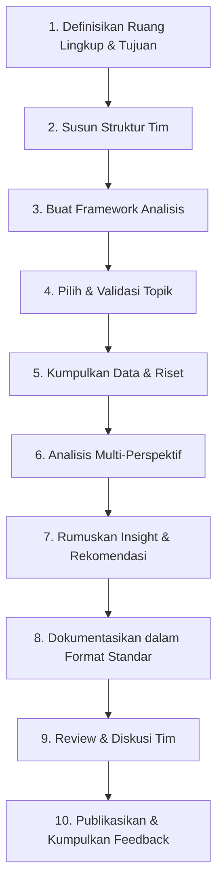

<div align="center">

# Business & Product Case Studies Team

**Business and product case studies that uncover actionable insights from multiple business perspectives to support strategic product decisions.**


</div>

---

## Tentang Project Ini

Tim ini fokus membedah studi kasus bisnis dan produk nyata (atau hipotetis) dari berbagai sudut pandang — **strategi, produk, operasional, dan pengguna** — untuk menghasilkan insight yang bisa langsung dipakai dalam pengambilan keputusan produk.

> Output akhir dari setiap case study idealnya bukan sekadar analisis akademis, tapi rekomendasi yang **actionable**:
> *"Apa yang sebaiknya dilakukan tim produk berdasarkan temuan ini?"*

---

## Tujuan

| # | Tujuan |
|---|--------|
| 1 | Melatih kemampuan berpikir strategis lintas fungsi (bisnis, produk, data, UX) |
| 2 | Membangun repository studi kasus yang bisa jadi referensi tim internal |
| 3 | Menghasilkan rekomendasi konkret yang bisa diuji atau diterapkan |
| 4 | Mengasah kemampuan storytelling data dan presentasi insight ke stakeholder |

---

## Daftar Isi

- [Setup Lokal](#setup-lokal)
- [Struktur Tim](#struktur-tim)
- [Framework Analisis](#framework-analisis)
- [Alur Kerja Case Study](#alur-kerja-case-study)
- [Struktur Folder](#struktur-folder)
- [Template Dokumentasi](#template-dokumentasi)

---

## Setup Lokal

Repo ini menyediakan **dataset retail star-schema** (`data/`) untuk latihan query dan analisis data — satu fact table + empat dimension table, lengkap dengan jawaban yang sudah diverifikasi (lihat [`data/README.md`](data/README.md)).

Untuk load dataset ini ke database dan latihan query beneran, jalankan PostgreSQL lokal lewat Docker:

| Panduan | Deskripsi |
|---|---|
| [`Docker.md`](Docker.md) | Cara install & jalankan PostgreSQL di Docker, sampai connect dari VS Code PostgreSQL extension |
| [`Data-Integration-Docker.md`](Data-Integration-Docker.md) | Cara load CSV di `data/` ke dalam database tersebut |
| [`Supabase-Migration.md`](Supabase-Migration.md) | Cara pindahin data ke Supabase supaya bisa diakses online / tanpa Docker |

---

## Struktur Tim

| Peran | Tanggung Jawab |
|---|---|
| **Case Lead** | Menentukan topik, koordinasi timeline, pembagian jobdesk |
| **Data Analyst** | Analisis model bisnis, dashboard, definisi KPI, bisnis insight & rekomendasi |
| **Data Engineer** | Setup GitHub dan Docker, ETL pipeline, data cleaning & transformation, database |
| **ML/Forecasting** | Feature engineering, training & tuning model, model evaluation |
| **Frontend** | Wireframe & desain Figma, UI/UX design, implementasi frontend |
| **Backend** | API endpoint, database connection, business logic, integrasi model ke web |

> Untuk tim kecil, satu orang bisa merangkap beberapa peran.

---

## Framework Analisis

Setiap case study menggunakan kombinasi framework berikut agar hasilnya konsisten:

- **Business Model Canvas** — untuk memahami model bisnis secara menyeluruh
- **SWOT / Porter's Five Forces** — untuk analisis kompetitif dan strategis
- **Jobs to be Done (JTBD)** — untuk memahami motivasi pengguna
- **RICE / ICE Scoring** — untuk memprioritaskan rekomendasi
- **North Star Metric & AARRR (Pirate Metrics)** — untuk sudut pandang growth/produk

Dokumentasikan framework ini di file terpisah (`/framework.md`) agar semua anggota tim pakai standar yang sama.

---

## Alur Kerja Case Study



### Rincian Tahapan

<details>
<summary><b>1. Definisikan Ruang Lingkup & Tujuan Tim</b></summary>

- Tentukan fokus: apakah case study bersifat industri umum, spesifik startup, atau internal perusahaan sendiri?
- Tetapkan target audiens dari hasil case study (misalnya: tim produk, calon investor, portofolio pribadi, komunitas belajar).
- Buat pernyataan misi singkat tim (bisa pakai deskripsi yang sudah kamu tulis sebagai starting point).
</details>

<details>
<summary><b>2. Susun Struktur Tim</b></summary>

Lihat bagian [Struktur Tim](#struktur-tim) di atas.
</details>

<details>
<summary><b>3. Buat Kerangka Kerja (Framework) Analisis</b></summary>

Lihat bagian [Framework Analisis](#framework-analisis) di atas.
</details>

<details>
<summary><b>4. Pilih & Validasi Topik Case Study</b></summary>

- Buat daftar kandidat perusahaan/produk yang menarik untuk dibedah.
- Prioritaskan berdasarkan: ketersediaan data publik, relevansi industri, tingkat kompleksitas.
- Validasi dengan tim: apakah topik ini cukup kaya untuk dianalisis dari banyak perspektif?
</details>

<details>
<summary><b>5. Kumpulkan Data & Riset</b></summary>

- Sumber: laporan tahunan, artikel berita, wawancara (jika memungkinkan), data publik (app store reviews, social listening, dsb).
- Catat semua sumber untuk menjaga kredibilitas dan menghindari klaim yang tidak terverifikasi.
- Simpan riset mentah di folder `/research/{nama-case}/`.
</details>

<details>
<summary><b>6. Lakukan Analisis Multi-Perspektif</b></summary>

Setiap case study sebaiknya dianalisis minimal dari 3 sudut pandang, misalnya:
- **Perspektif Bisnis** — model revenue, unit economics, positioning pasar
- **Perspektif Produk** — fitur utama, user flow, diferensiasi
- **Perspektif Pengguna** — pain point, motivasi, hambatan adopsi
- **Perspektif Kompetitif** — bagaimana posisi terhadap pesaing
</details>

<details>
<summary><b>7. Rumuskan Insight & Rekomendasi</b></summary>

- Insight harus spesifik dan didukung data, bukan opini umum.
- Setiap insight idealnya diikuti rekomendasi aksi yang jelas: *"Karena X, tim produk sebaiknya melakukan Y untuk mencapai Z."*
- Gunakan prioritization framework (RICE/ICE) untuk mengurutkan rekomendasi mana yang paling berdampak.
</details>

<details>
<summary><b>8. Dokumentasikan dalam Format Standar</b></summary>

Lihat bagian [Template Dokumentasi](#template-dokumentasi) di bawah.
</details>

<details>
<summary><b>9. Review & Diskusi Tim</b></summary>

- Lakukan sesi review internal sebelum publikasi — cek validitas argumen, bukan hanya kerapian tulisan.
- Undang perspektif "devil's advocate" untuk menguji ketahanan rekomendasi.
</details>

<details>
<summary><b>10. Publikasikan & Kumpulkan Feedback</b></summary>

- Publikasikan case study (blog internal, Notion, Medium, atau repo ini).
- Minta feedback dari luar tim untuk menguji apakah insight benar-benar actionable.
- Update case study jika ada data baru yang relevan.
</details>

---

## Struktur Folder

```
.
├── data/                          # Dataset retail star-schema
│   └── README.md
├── research/
│   └── {nama-case}/                # Riset mentah per case study
├── templates/
│   └── case-study-template.md      # Template dokumentasi standar
├── framework.md                    # Dokumentasi framework analisis
├── Docker.md
├── Data-Integration-Docker.md
├── Supabase-Migration.md
└── README.md
```

---

## Template Dokumentasi

Buat template case study, misalnya:

```
1. Ringkasan Eksekutif
2. Latar Belakang Perusahaan/Produk
3. Masalah/Tantangan yang Dibahas
4. Analisis (per perspektif)
5. Temuan Kunci (Key Insights)
6. Rekomendasi Strategis
7. Referensi/Sumber Data
```

Simpan template ini di `/templates/case-study-template.md`.

<div align="center">

*Dibangun untuk melatih strategic thinking lintas fungsi — bisnis, produk, data, dan UX.*

</div>
