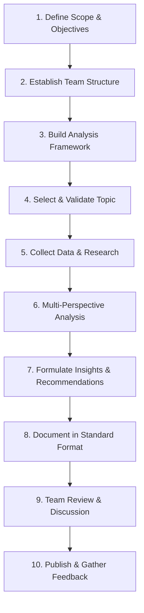

<div align="center">

# Retail Analytics Platform

**An interactive analytics platform that helps users understand sales performance and obtain revenue predictions to support data-driven business decisions.**


</div>

---

## About This Project

This team focuses on dissecting business and product case studies from the perspective of **strategy, product, operations, and users**, with the current main case study being: **Retail Analytics Platform**.

> **Main goal:** build a portfolio to increase employability.
>
> **Web goal:** provide an interactive analytics platform that helps users understand sales performance and obtain revenue predictions to support data-driven business decision-making.

The final output of each case study is ideally not just academic analysis, but **actionable** recommendations:
*"What should the product team do based on these findings?"*

---

## Objectives

| # | Objective |
|---|--------|
| 1 | Train cross-functional strategic thinking (business, product, data, UX) |
| 2 | Build a repository of case studies that can serve as an internal team reference |
| 3 | Produce concrete recommendations that can be tested or implemented |
| 4 | Sharpen data storytelling and insight presentation skills for stakeholders |

---

## Reference Links

Useful links during project development:

| Reference | Link |
|---|---|
| Dataset | [misata.studio/datasets/retail-star-schema](https://www.misata.studio/datasets/retail-star-schema) |
| GitHub Org | [Retail-Analytical-Platform](https://github.com/Retail-Analytical-Platform) |
| Website overview (inspiration) | [goinsight.in/demo/retail](https://www.goinsight.in/demo/retail) |
| Forecasting dashboard reference | [walmart-sales-forecasting-dashboard](https://github.com/acaca675/walmart-sales-forecasting-dashboard) |
| Other reference | [biziinsights.com](https://www.biziinsights.com/) |

---

## Local Setup

This repo provides a **retail star-schema dataset** (`data/`) for query and data-analysis practice — one fact table and four dimension tables, complete with verified answers (see [`data/README.md`](data/README.md)).

To load this dataset into a database and practice real queries, run PostgreSQL locally via Docker:

| Guide | Description |
|---|---|
| [`Docker.md`](../Docker.md) | How to install & run PostgreSQL in Docker, up to connecting from the VS Code PostgreSQL extension |
| [`Data-Integration-Docker.md`](../Data-Integration-Docker.md) | How to load the CSVs in `data/` into that database |
| [`Supabase-Migration.md`](../Supabase-Migration.md) | How to migrate the data to Supabase so it can be accessed online / without Docker |

---

## Team Structure

| Position | Name | Job Description |
|---|---|---|
| Data Engineer | Joseph | Set up GitHub, Docker, Supabase, PostgreSQL; ETL query pipeline; large-scale data cleaning & transformation; data modeling (database schema) |
| Data Analyst | Niko | EDA & business analysis, KPI/metric definitions, reporting queries for dashboards, Tableau dashboards (calculated fields/LOD), business insights & recommendations, data validation, forecast result interpretation |
| Forecast Support | Joseph + Bayu | Feature engineering, forecast model training & tuning |
| UI/UX Frontend | Ferly | Wireframes & design in Figma, frontend implementation (React/Next.js) |
| Backend | Brian | API endpoints (auth, database connection, general website features) |
| Backend – ML/Forecast | Bayu | FastAPI to serve the forecast model, forecast integration into the website, assist with model training alongside Joseph |
| Frontend + Deployment | Reva | React/Next.js frontend, API component integration, responsive UI, deployment, env configuration |

> For a small team, one person may take on multiple roles.

### Job Description Details

<details>
<summary><b>Data Engineer (Joseph)</b></summary>

- Data Profiling: check data condition (missing values, value ranges, data types, duplicates)
- Data Cleaning: clean null values, invalid values, duplicates, date formats (Indonesian format: day/month/year)
- Data Transformation: convert data types, standardize categories (e.g., the `home office`/`homeoffice`/`homeofice` segment standardized)
- ETL: extract → transform → load process into the database
- Data modeling: build the star schema
- Database prep: Postgres → web preparation
- Dataset prep: prepare the dataset for the Data Analyst
- Documentation
</details>

<details>
<summary><b>Data Analyst (Niko)</b></summary>

- Identify business goals and conduct business analysis (EDA)
- Build the model in Tableau
- Create measures/calculated fields needed for business objectives
- Build overview scorecard dashboards, store & product detail dashboards, customer detail dashboards
- Generate business insights based on dashboards & business recommendations
- Determine targets, business objectives, forecast intervals based on data needs, descriptive analysis, result analysis and business interpretation
</details>

<details>
<summary><b>Forecast — Joseph (time series & feature engineering) + Bayu (modeling through serving)</b></summary>

- Time series analysis: analyze historical trends and patterns
- Feature engineering: rolling average, lag, etc.
- Modeling: build the initial model (candidate: XGBoost, open to other model suggestions)
- Training
- Hyperparameter tuning: simple configuration
- Model evaluation: MAE, RMSE, MAPE
- Model selection: choose the best model to deploy on the web (if time allows, two models can be compared)
</details>

<details>
<summary><b>Frontend (Ferly)</b></summary>

- UI/UX design in Figma
- Landing page
- Analytics page
- Forecast page
- What-if page (later)
- Interactive elements to make it easier for users to read data from charts
</details>

<details>
<summary><b>Frontend Integration & Deployment (Reva)</b></summary>

- Review & continued implementation of components from Ferly's design (Next.js) — consistency across pages
- Tableau embed integration into the website
- API integration with the backend (Brian & Bayu's endpoints — auth, data retrieval, forecast)
- Responsive UI across various screen sizes/devices
- Website deployment (hosting, build & release process)
- Environment configuration (env variables, API base URL, secrets management)
</details>

<details>
<summary><b>Backend (Brian, assisted by Bayu)</b></summary>

- Database connection
- Authentication & authorization
- API development along with documentation
- Business logic
- Data retrieval
</details>

---

## Task Status

| Status | Description |
|---|---|
| **Brainstorm** | The earliest stage, the task is still under discussion. Moving forward requires approval from others |
| **Not started** | The idea has been approved but work has not yet begun |
| **In progress** | The idea is being worked on / under development. Once finished, move to Review |
| **Review** | Assessment stage of the implementation results. Can proceed to Done or Starting Over |
| **Reopen** | The implementation still needs to be reviewed. Write down the shortcomings on the related page so they can be fixed, then move it back into Review |
| **Done** | Final stage |

### How to Reject a Page at the Review Stage

1. Go to the Review page (click the task to open its page).
2. Write down the task's shortcomings at the bottom of the page.
3. Move the status to **Starting Over** / **Reopen** (drag on the board, or change the status directly on the page).

### How to Add a Task

1. Click **"+ New page"** in the Brainstorm section.
2. Open the task page, then fill in the task details (task name, person in charge, and job description details).

---

## Website Overview

1. **Overview**
   - Hero: Retail Analytics Platform tagline + image + button leading to the Analytics page
   - Trend summary for total sales, total orders, total customers, and average order value (in a single row)
   - A larger sales trend chart, 1-year time range with monthly intervals
   - A brief key-insight box based on the chart (e.g., "this year's sales trend is Rp100 million, an increase of X%")
2. **Analytics**
   - Embedded Tableau in the center of the page (1-year sales trend chart), with a dropdown for analysis by store, by product, by customer segment, and revenue
   - More detailed business insights
3. **Forecast**
   - Actual vs. predicted chart, with a dropdown for prediction target (revenue, customer, product — revenue prioritized) and forecast time horizon
   - Accuracy metrics display: MAE, RMSE, MAPE
   - Prediction table for several upcoming periods (month – prediction – range)
   - Business insights from the forecast results
4. **What-if**
   - Control panel at the top to change the promo percentage (`discount_promo` in `fact_penjualan`), including affected region and segment
   - Chart comparing the user-modified promo scenario vs. baseline
   - Estimated revenue & order volume, along with the percentage comparison against baseline
   - Business scenario insights
5. **About us**
   - Team members, their job descriptions, and LinkedIn links

---

## Business Problems & Goals

### Business Problems

Stakeholders need revenue analysis for each store, product category, and customer segment to understand current business performance and obtain revenue projections as a basis for decision-making.

### Business Goals

Help stakeholders understand revenue performance, identify business opportunities and problems, project future performance, and evaluate various business scenarios.

### Business Questions

- Which product categories generate the largest revenue in each region?
- How has revenue grown month over month over the past 1 year?
- Are premium products sold more in the Corporate or Consumer segment?
- Which stores have a higher average transaction value compared to their region's average?
- What is the revenue projection for the upcoming period?
- How can changes in certain metrics affect revenue?

### Business Objectives

- Monitor revenue performance by time, region, store, product category, and customer segment
- Identify factors affecting revenue performance and areas experiencing decline
- Provide predictions for revenue projections to support business planning
- Evaluate the impact of various changes/scenarios on revenue through what-if simulations
- Generate insights that can be used to determine revenue growth strategies

### Planning

**Monitor → Analyze → Predict → Simulate → Decide**

| Stage | Description |
|---|---|
| Overview | Provide a general picture of business condition and performance |
| Analytics | Explore performance by region, store, product, and customer |
| Forecast | Provide revenue projections to aid future planning |
| What-If | Simulate various scenarios to help evaluate decision alternatives |

### Expected Business Outcome

Stakeholders can understand the overall business condition, identify areas that need improvement and growth opportunities, and make more measured decisions based on data.

---

## Analysis Framework

Each case study uses a combination of the following frameworks to keep results consistent:

- **Business Model Canvas** — to understand the business model as a whole
- **SWOT / Porter's Five Forces** — for competitive and strategic analysis
- **Jobs to be Done (JTBD)** — to understand user motivation
- **RICE / ICE Scoring** — to prioritize recommendations
- **North Star Metric & AARRR (Pirate Metrics)** — for a growth/product perspective

Document this framework in a separate file (`/framework.md`) so all team members use the same standard.

---

## Case Study Workflow



## Folder Structure

```
.
├── data/                          # Retail star-schema dataset
│   └── README.md
├── research/
│   └── {case-name}/                # Raw research per case study
├── templates/
│   └── case-study-template.md      # Standard documentation template
├── framework.md                    # Analysis framework documentation
├── Docker.md
├── Data-Integration-Docker.md
├── Supabase-Migration.md
└── README.md
```

---

## Documentation Template

Create a case study template, for example:

```
1. Executive Summary
2. Company/Product Background
3. Problem/Challenge Discussed
4. Analysis (per perspective)
5. Key Insights
6. Strategic Recommendations
7. References/Data Sources
```
